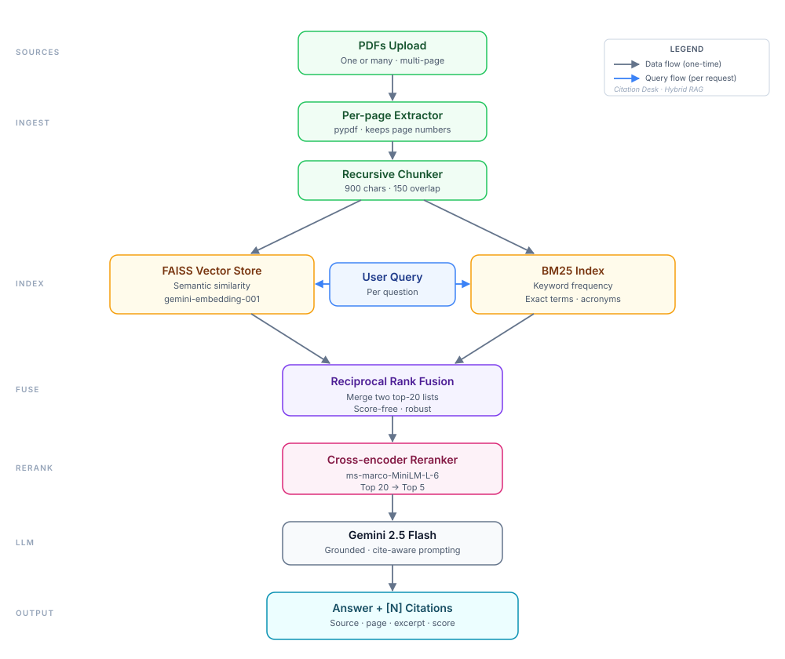

# Citation Desk

[](https://anand15-og-citation-desk-app-k0peps.streamlit.app/)
[](https://www.python.org/)
[](https://ai.google.dev/)
[](LICENSE)

> 🚀 **Live Demo:** [https://anand15-og-citation-desk-app-k0peps.streamlit.app](https://anand15-og-citation-desk-app-k0peps.streamlit.app/)

Citation Desk is an intelligent, personal research workspace for organizing PDF
reading collections, querying documents with verifiable inline citations, and
exporting structured research briefs.

[Security notes](SECURITY.md)

## What It Demonstrates

- PDF text extraction with page-level metadata preservation
- Overlapping document chunking optimized for technical papers
- Google Gemini dense embeddings paired with FAISS semantic search
- BM25 sparse keyword retrieval for exact term and acronym matching
- Reciprocal Rank Fusion (RRF) combining dense and sparse candidate sets
- Local Hugging Face cross-encoder reranking for high precision
- Grounded Gemini generation strictly constrained to retrieved context blocks
- Inline bracketed citations mapped back to specific source files and page numbers
- Automatic document summaries, follow-up query suggestions, and token accounting
- Markdown chat and research-brief export
- Offline unit tests and automated GitHub Actions CI

Citation Desk is a portfolio RAG application designed for focused research exploration.

## Architecture



## Retrieval Pipeline

```text
PDFs
  -> Page-level text extraction
  -> Overlapping chunks with source & page metadata
  -> FAISS semantic retrieval + BM25 keyword retrieval
  -> Reciprocal Rank Fusion (top 20 candidates)
  -> Cross-encoder reranking (top 5 high-precision passages)
  -> Gemini answer synthesis with numbered context blocks
  -> Cited-source filtering and interactive UI rendering
```

## Citation Boundary

Each context chunk receives a unique marker such as `[1]`. The answer prompt instructs
Gemini to cite those markers inline when making claims. Citation Desk displays only valid
markers that actually appear in the generated answer, preserving their original page
and source mapping.

## Data Handling & Limits

Extracted PDF text is sent to Google Gemini for summaries, embeddings, answers,
and follow-up generation. A local Hugging Face cross-encoder reranks retrieved
chunks. The UI requires users to acknowledge this before processing documents.

Current limits:
- Up to 5 PDFs per ingestion batch
- Up to 20 MB per file
- Up to 200 extracted pages
- Up to 1,000,000 extracted characters

Do not upload sensitive documents to public deployments. See [SECURITY.md](SECURITY.md).

## Run Locally

### Requirements
- Python 3.11+
- Gemini API key from [Google AI Studio](https://aistudio.google.com/apikey)

### macOS / Linux (bash / zsh)

```bash
git clone https://github.com/anand15-og/citation-desk.git
cd citation-desk
python3 -m venv .venv
source .venv/bin/activate
pip install -r requirements.txt
cp .env.example .env
streamlit run app.py
```

### Windows (PowerShell)

```powershell
git clone https://github.com/anand15-og/citation-desk.git
cd citation-desk
python -m venv .venv
.\.venv\Scripts\Activate.ps1
python -m pip install -r requirements.txt
Copy-Item .env.example .env
streamlit run app.py
```

Add your Gemini API key to `.env`:
```env
GOOGLE_API_KEY=your_gemini_api_key_here
```

## Tests

The automated suite runs completely offline without downloading model weights or making API calls. It covers chunk metadata preservation, RRF merging, citation-marker alignment, cited-source filtering, follow-up parsing, text normalization, and ingestion limits.

```bash
pip install -r requirements-dev.txt
pytest
```

## Project Layout

```text
citation-desk/
|-- .github/workflows/tests.yml    # CI test automation
|-- tests/test_pipeline.py         # Offline pytest suite
|-- app.py                         # Streamlit UI & interactive workspace
|-- pipeline.py                    # RAG engine (FAISS + BM25 + RRF + Reranker)
|-- prompts.py                     # Grounded prompt templates
|-- architecture.svg               # Architectural diagram
|-- LICENSE                        # MIT License
|-- SECURITY.md                    # Data handling and security policies
|-- requirements.txt               # Production dependencies
`-- README.md                      # Project documentation
```

## Tech Stack

- **Framework**: Python 3.11+, Streamlit
- **LLM & Embeddings**: Google Gemini 2.5 Flash, `gemini-embedding-001`
- **Retrieval**: FAISS (dense vector store), BM25 (sparse lexical), Reciprocal Rank Fusion
- **Reranking**: Hugging Face Cross-Encoder (`cross-encoder/ms-marco-MiniLM-L-6-v2`)
- **Document Processing**: LangChain Core/Community, PyPDF

## Limitations

- Scanned or image-only PDFs require OCR (not included)
- In-memory session indexes (no persistent database required)
- First cross-encoder load downloads model weights locally
- Quantitative faithfulness benchmark suite in progress

## License

This project is licensed under the [MIT License](LICENSE).
